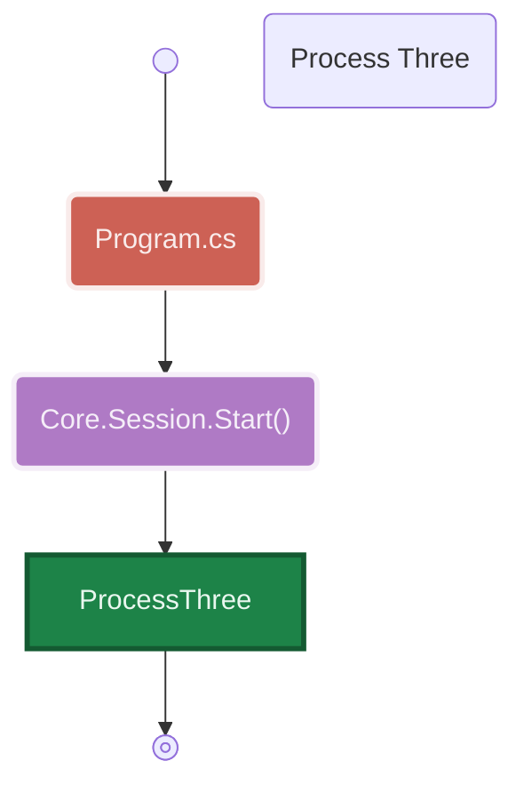

# Flow

```mermaid
flowchart TB
    %% Components
    Start@{shape: sm-circ, label: "Start"}
    Program.cs@{shape: rounded, label: "Program.cs"}
    Core.Session.Start@{shape: rounded, label: "Core.Session.Start()"}
    Core.Session.Sstart@{shape: rounded, label: "Process Three"}
    Stop@{shape: fr-circ, label: "Release"}
    %% Layout
    Start --> Program.cs:::R2_ --> Core.Session.Start:::P2_ --> ProcessThree:::G8_ --> Stop
    %% Styles
    classDef R2_ stroke:#f9ebea,stroke-width:3px,fill:#CD6155,color:#f9ebea
    classDef P2_ stroke:#f5eef8,stroke-width:3px,fill:#af7ac5,color:#f5eef8
    classDef G8_ stroke:#145a32,stroke-width:3px,fill:#1d8348,color:#e9f7ef
```
