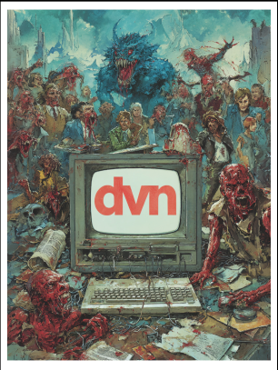

<!-- u250801 -->

<div align="center">

  

  &nbsp;&nbsp;
  [](#)&nbsp;&nbsp;
  [](#)&nbsp;&nbsp;
  [](#)&nbsp;&nbsp;
  

</div>

# About **dvn**

**dvn** is a command-line utility for managing development environments.

Let's say you are working something called "MyProject", which requires:

* A Visual Studio 2022 solution named "*MyProject*"
* A Visual Studio Code workspace named "*MyProject-Documentation*"
* A Visual Studio Code workspace named "*Other-Documentation*"
* GitHub Desktop
* Specific data to be backed up

You *could* do all of the above steps manually, *or* you could let **dvn** do it for you by typing

```bash
dvn myproject
```

## Pre-requisites

* Windows operating system (MacOS/Linux versions are on the roadmap)
* [.NET 9](https://dotnet.microsoft.com/en-us/download/dotnet/9.0)

# Initial setup

The initial setup of **dvn** will:

1. Install the **dvn application**
2. Create the **dvn framework**

## Installing the **dvn** application

**dvn** is a portable application, so "installing" is simple:

1. Download the [latest release]()
2. Extract the contents of the downloaded file to a folder of your choice

You'll notice that the folder you extracted to contains a single item: `dvn.exe`

## Creating the **dvn** framework

The **dvn framework** are the files and folders that are required by **dvn**. This framework doesn't exist yet, so we need to create it.

To create the **dvn** framework:

1. Open a terminal in the the folder that contains `dvn.exe`
2. Type

```bash
dvn
```

Since this is the first time you are executing **dvn**, you will see a message letting you know that the **dvn framework** will be created.

# Using **dvn**

This is the **dvn** syntax:

```bash
dvn <command> [-option01 -option02 ...]
```

## Commands

**dvn** *requires* that you pass a valid `command`.

In general, you'll use the `%environment%` command, which will start the specified development environment (or create a blank [manifest file](), if one doesn't exist).

For example, to start/create the `myproj` environment, you would type

```bash
dvn myproj
```

To get a list of valid commands, type

```bash
dvn help
```

## Options

**dvn** also accepts `options`, which are...optional

Options:

* Must be a single character
* Start with the `-` (dash) character
* Are separated by a space

For example, you can force the data for the `myproj` environment to be backed up by typing

```bash
dvn myproj -b
```

To get a list of valid options, type

```bash
dvn help
```

# Manifest files

When you start an environment by typing

```bash
dvn myproj
```

**dvn** looks for a manifest file named `.\.dvn\manifests\myproj.dvn.manifest`, which contains all of the information **dvn** needs to start the environment.

If the file does not exist, it is created using the default settings, which you will need to modify.

> **PLEASE NOTE!**  
> Any "`\`" characters in the manifest file need to be escaped as "`\\`".

## The default manifest

When a new manifest file is created, it looks like this:

```json
{
  "DevelopmentEnvironment": {
    "Name": "%environment%",
    "Description": "Default development environment",
    "BackupEnabled": false,
    "BackupSources": [
      "\\Path\\To\\Source1",
      "\\Path\\To\\Source2"
    ],
    "BackupLocation": "\\Path\\To\\Backup"
  },
  "EnvironmentApplications": [
    {
      "Name": null,
      "Description": null,
      "FileName": null,
      "Arguments": null,
      "WorkingDirectory": null
    }
  ]
}
```

## Manifest components

Manifest files contain the following components:

* `Name`  
The name of the environment (e.g., "myproj").

* `Description`  
The description of the environment (e.g., "My project environment").

* `BackupEnabled`  
Determines if the data backup functionality is *enabled* ("true"), or *disabled* ("false").

* `BackupSources`  
Absolute paths to data that will be backed up, if the data backup functionality is enabled.  

* `BackupLocation`  
The absolute path where backups are created.

* `EnvironmentApplication`  
Each application that will be launched by **dvn** has it's own block with the following data:

  * `Name`  
  The name of the application

  * `Description`  
  Description of the application

  * `FileName`  
  The application file name

  * `Arguments`  
  Any command-line arguments

  * `WorkingDirectory`  
  The application working directory

A completed manifest file looks like this:

```json
{
  "DevelopmentEnvironment": {
    "Name": "myproj",
    "Description": "My project environment",
    "BackupEnabled": true,
    "BackupSources": [
      "C:\\repositories\\MyProject",
      "C:\\data\\reports"
    ],
    "BackupLocation": "C:\\backups",
  },
  "EnvironmentApplications": [
    {
      "Name": "Visual Studio - MyProject",
      "Description": "MyProject solution",
      "FileName": "MyProject.sln",
      "Arguments": null,
      "WorkingDirectory": "C:\\repositories\\MyProject\\src"
    },
    {
    "Name": "Visual Studio Code - MyProject documentation",
    "Description": "MyProject documentation",
    "FileName": "Code.exe",
    "Arguments": "MyProject-documentation.code-workspace | exit /b",
    "WorkingDirectory": "\\path\\to\\VisualStudioCode"
    },
    {
    "Name": "Visual Studio Code - Other documentation",
    "Description": "Other documentation",
    "FileName": "Code.exe",
    "Arguments": "Other-documentation.code-workspace | exit /b",
    "WorkingDirectory": "\\path\\to\\VisualStudioCode"
    },
    {
      "Name": "GitHub Desktop",
      "Description": "GitHub Desktop",
      "FileName": "GitHubDesktop.exe",
      "Arguments": null,
      "WorkingDirectory": "C:\\Users\\JaneSmith\\AppData\\Local\\GitHubDesktop"
    }
  ]
}
```

> **REMINDER!**  
> Any `\` characters need to be escaped as `\\`!

The above manifest file will:

1. Start the "**myproj**" development environment
2. Backup the "**C:\repositories\MyProject**" and "**C:\data\reports**" to "**C:\backups**"
3. Start the "**MyProject**" solution in Visual Studio
4. Start the "**MyProject-Documentation**" workspace in Visual Studio Code
4. Start the "**Other-Documentation**" workspace in Visual Studio Code
3. Start the "**GitHub Desktop**" application

# Configuring **dvn**

The `.\.dvn\configs\dvn.config` file contains the [configuration settings]() for **dvn**.

Currently this file only contains a list of files and folders that are ignored when the data backup functionality is enabled (to keep file sizes are kept to a minimum), so their isn't much to configure...yet.
